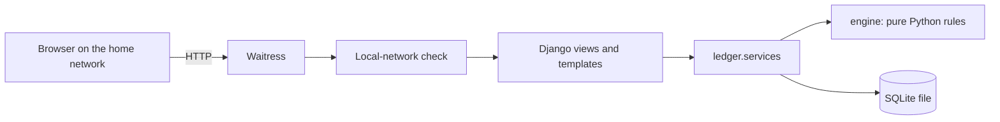
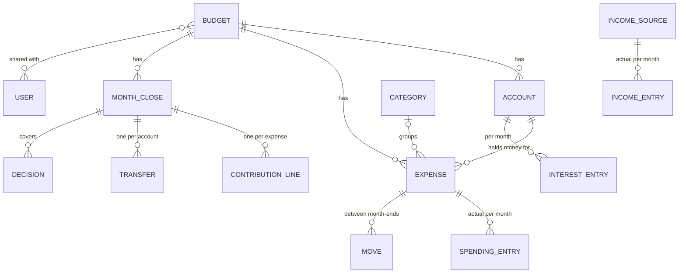

# Budget Manager – Design

Requirements are in [requirements.md](requirements.md). This document describes how the app
meets them and records the decisions taken along the way. The old spreadsheet only showed where
the budget came from; the requirements are the source of truth.

## Decisions

| Question | Decision |
|---|---|
| Accounts | Customisable. Four to start with: **NemKonto**, **Budget**, **Food** and **Savings**. The NemKonto always exists and cannot be deleted. |
| General Savings | Not a separate bank account: it is the part of the **savings account** not set aside for a savings goal. Exactly one account holds it (Savings by default; it can be moved). |
| Expenses | Defined in the app: name, amount, first due date and frequency, type, category and account. They can be dragged between categories (or accounts) on the expenses board. A food budget is just a running expense linked to the Food account. |
| Expense types | **Fixed**: the same amount on its due date (rent, insurance). **Variable**: a bill on its due date whose amount varies (power, heating). **Running**: spent bit by bit through the month (food, fuel, everyday spending); monthly from the 1st, no due date. Only fixed expenses are topped up automatically. Only running expenses can live on the NemKonto: their money stays there without a transfer, and the NemKonto minimum and maximum apply to the rest. |
| Interest | Every account can receive (or pay) interest. It is entered per account at each month-end and counts as if it had arrived on the NemKonto, so the next transfer to that account is smaller. |
| Month-end routine | On the last day of a month: enter that month's actual spending, the interest received, next month's income (it arrives at the end of the month), then make the transfers. |
| Forecast | Uses expected amounts for everything not yet entered. |
| Budgets | Several budgets (for example private and a company), each with its own accounts, expenses, income and month-ends. A budget is shared with the people chosen in its settings; they all see and edit the same data. Budgets can be created from scratch or copied. |
| Setup | A five-step checklist per budget: accounts with today's balances, expenses, a summary of what they cost, income, then the transfers that start the budget. |
| Interface | English. Amounts as plain numbers like `1.234,56`, no currency. |
| Layout | The dashboard layout (sidebar, status first) with the month-end as a step-by-step checklist. |

## Architecture

| Part | Choice | Why |
|---|---|---|
| Web framework | Django 5.2 | Login, sessions, CSRF protection, forms and migrations built in. |
| Server | Waitress + WhiteNoise | Pure Python, runs anywhere, serves static files itself. |
| Storage | SQLite in `BUDGET_DATA_DIR` | Local, one file, easy to back up. |
| Money | Whole hundredths (øre) | No rounding errors. |
| Rules | `budget_manager.engine` | No Django imports, so every rule is unit tested on its own. |
| Charts | SVG drawn on the server | No JavaScript chart library; works offline. |
| JavaScript | One small file | Only for conveniences (drag and drop, live balances, fill buttons, copy). Every page works without it. |
| Local only | Middleware checks the connecting address against private ranges; login required everywhere | The app refuses the internet even if a port is forwarded by mistake. |
| Budgets in the address | Every page of a budget lives under `/b/<id>/` (`ledger/scope.py`) | The middleware strips the prefix before Django resolves the URL and sets it as the script prefix, so views and templates are unchanged and every link they build stays in the same budget. Two tabs on two budgets never mix them up. A page opened without a budget goes to the last one used. |

## Setting up a budget

A new budget (or a copy of only the setup) starts with **Set up** in the menu. Each step opens
once the one before it is done; earlier steps can be changed at any time until the first
month-end.

1. **Accounts**: today's bank balance of every account, and the NemKonto minimum and maximum.
   Accounts can be added, renamed or removed here.
2. **Expenses**: added one at a time with the essentials (amount, frequency, next due date,
   account, category, type). Categories can be added, renamed and removed on the same page. The
   next one starts with the same account, category
   and frequency.
3. **Summary**: what the expenses cost a month, per category and per account. A repeating
   expense counts as its amount divided by its interval, a one-off goal as its amount spread
   over the months until it is due.
4. **Income**: the expected income, compared with the expenses.
5. **Transfers**: per expense, what should have been set aside at the start of the current
   month so the monthly amount stays steady (a yearly 1.200 due in two months should already
   hold 1.000; a payment due this month must be there in full). Fixed payments follow their due
   dates (due before today: paid; later: still on the account); only running expenses, like
   food, ask what has been spent so far this month. Each account's surplus or shortage is
   evened out through General Savings; the page lists those bank transfers and previews the
   first month-end. **Start the budget** saves the starting point, and the overview keeps
   showing the transfers until they are marked done.

The first month-end then asks for the rest of the current month's spending.

## The month-end

A **budget month** is the month whose payments a transfer pays for. The transfers for May are made
on 30 April, funded by the income that arrives at the end of April. The checklist on 30 April:

1. **April spending**: what each expense actually cost in April.
2. **April interest**: interest per account (negative if paid).
3. **May income**: what arrived on the NemKonto.
4. **Transfers**: the app computes one net transfer per account; tick them off as they are made.
5. **Check and close**: compare the balances with the bank (optional), then close. Closing
   freezes the month; the latest month-end can be reopened.

### Rules (engine/close.py)

For budget month *B*:

1. **Fixed expenses below zero** after last month's spending are topped up from General Savings.
   If the payment in a due month cost more than expected, the expected amount is raised to the
   real cost.
2. **Contribution per expense**: each saving period (the transfers up to a payment) uses one
   fixed amount, `(amount − planned balance at the start of the period) / transfers in the
   period`, rounded up to whole units. The transfer is the same every month, so it can be a
   standing order; rounding up overshoots a little (66 a year is saved as 12 × 6) and the next
   period starts from what is left. If the amount changes, the missing money is caught up by the
   due date (the 500 → 600 example). Monthly payments are topped up exactly. Expenses whose end
   date has passed get nothing.
   The *planned* balance assumes every payment cost what was expected, so actual deviations never
   change the contributions: the actual balance of a variable expense may go below zero or build
   up, and a fixed expense below zero is handled by rule 1.
3. **Transfer per account** = its contributions − interest that landed on it (+ top-ups).
4. **NemKonto**: what is left after the transfers is kept between the minimum X and maximum Y.
   Above Y the excess goes to General Savings; below X the difference comes from General Savings.
   If General Savings cannot cover it there is a warning and the NemKonto may end below X. If it
   would end below 0, the person chooses which expenses or savings goals to take the money from
   (a *cover*); later contributions rebuild them.
5. All movements are netted, so each account gets one transfer from (or to) the NemKonto.

### Balancing between month-ends

Money can move between General Savings and the expenses on any day, not only at a month-end. Each
move waits on the **Balance** page until its bank transfer is made:

| Move | Effect |
|---|---|
| **Fill** a new expense | It gets what its steady monthly amount would already have saved (600 a year due in two months: 500 now, then 50 a month). This counts towards the plan. Without it, the first payment is split over the months left (300, 300, then 50). |
| **Top up** an expense | Chosen on its edit page, for example a variable expense that stayed below zero. Does not change the plan. |
| **Return** money to General Savings | Chosen on the expense's page. An **ended** expense returns what is left by itself, once its last payment has been entered. |
| **Refund** | Money that came back (for example a surplus from the insurance company) goes to General Savings. |

The page nets the waiting moves into one bank transfer per account, to or from the account holding
General Savings. **Transfers made** records them (table `Move`, with the budget month of the next
month-end) and the balances update at once. A move can be undone until the next month-end, and a
month-end cannot be closed while moves are waiting. In the engine a made move is an `Adjustment`
on the expense: it changes the actual balance, and a filling also the planned balance.

When expenses on average need more than the expected income (a repeating expense counts as its
amount divided by its interval), adding or changing an expense or income shows a warning, also on
the overview: how much General Savings pays each month and the month it runs out.

The forecast (engine/forecast.py) runs the same close forward, assuming expected income, expected
spending and no interest for everything not yet entered.

## Data model

| Table | Holds |
|---|---|
| `Budget` | Name, the people who can use it, first budget month, NemKonto minimum and maximum, starting balances of the NemKonto and General Savings, forecast length, how far the setup has come. Accounts, categories, expenses, income, corrections, month-ends and moves each belong to one budget. |
| `Account` | Name, role (`nemkonto`, `savings` that holds General Savings, or `normal`) and the bank balance entered in the setup. |
| `Category` | Name and order. |
| `Expense` | Amount, first due date, frequency in months (0 = once), end date, type (fixed, variable or running), account, category, starting balance, first month with a contribution. |
| `IncomeSource` | Expected amount, first month, frequency, last month. |
| `SpendingEntry`, `IncomeEntry`, `InterestEntry` | What actually happened, one row per month. |
| `MonthClose` | One per budget month: status (in progress or closed), the NemKonto and General Savings flow, notices. |
| `ContributionLine` | Frozen per expense and month: contribution, expected payment, top-up, cover, release, amount change. |
| `Transfer` | The net transfer per account, and whether it has been made. |
| `Decision` | Covers chosen for a month-end. |
| `Move` | Money moved between General Savings and an expense, or a refund, between month-ends. |
| `BalanceCorrection` | Manual corrections of the NemKonto or General Savings (for example a bank fee). |

Balances are never stored; they are derived from the starting balances, the frozen lines and the
entries. Past months keep their frozen values when a plan changes.

### Importing bank statements later

Spending, income and interest are stored per month, separately from the rules. An import would add
a `BankTransaction` table with the raw lines (date, text, amount, account, a unique reference to
avoid duplicates) and a screen to assign each line to an expense, income source or interest. The
assigned lines are summed into the existing monthly entries, so nothing else changes.
