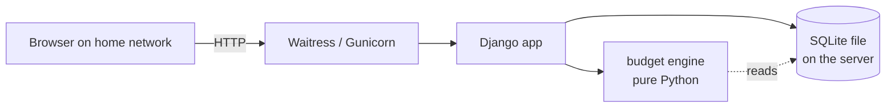
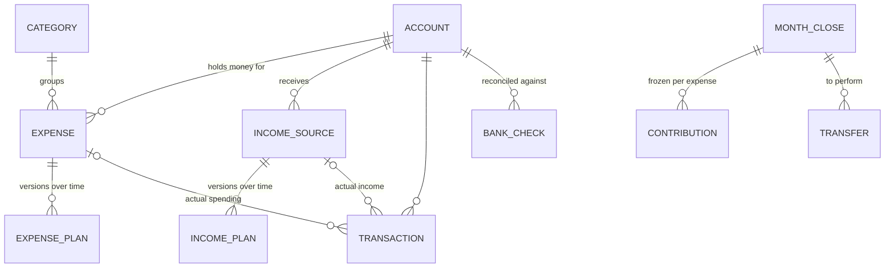

# Budget Manager – Design proposal (draft)

Status: proposal for review. Requirements are in [requirements.md](requirements.md).
Open questions are at the end. Personal figures from the budget spreadsheet are
deliberately kept out of this repository, because the repository is public.

## 1. Architecture



| Concern | Choice | Why |
|---|---|---|
| Web framework | **Django** | Built-in login, sessions, users, CSRF protection, forms, migrations and an admin site. Most of the "Management" feature comes for free, and there is little glue code to maintain. |
| Interactivity | Server-rendered templates + **HTMX** | Inline editing and live recalculation without a JavaScript build step. Stays readable Python + HTML. |
| Charts | A small chart library loaded as a static file (e.g. Chart.js) | Only needed for forecast and history. |
| Storage | **SQLite** in a single file on the server | Local, no separate database server, and backups are just copying the file. |
| Money | Integers in **øre** (hundredths) | No float rounding errors. Formatted as plain numbers, e.g. `1.234,56`, with no currency. |
| Calculation | A pure `budget_manager.engine` package with no Django imports | The transfer and forecast rules are the hard part. Keeping them pure makes them easy to unit test with pytest and freezegun. |
| LAN-only access | Bind to the LAN interface, set `ALLOWED_HOSTS`, and add middleware that rejects any client IP outside private ranges (`10/8`, `172.16/12`, `192.168/16`, `127/8`). The router must not forward the port. | Defence in depth, even if a port is forwarded by mistake. |
| Deployment | `uv run` + Waitress as a systemd service, or a single Docker container. Nightly SQLite backup via `sqlite3 .backup`. | Simple on a home server or Raspberry Pi. |
| Tooling | Existing uv, ruff, pytest, commitizen and CI setup is kept. | |

Package layout:

```
src/budget_manager/
  engine/        # pure calculation: schedules, contributions, month close, forecast
  web/           # Django project: settings, urls, LAN-only middleware
  ledger/        # Django app: models, views, templates, admin
tests/
  unit/engine/   # rule tests (no database)
  integration/   # Django views and models
```

## 2. Data model



**Account**
`name`, `role` (`nemkonto` | `general_savings` | `normal`), `min_balance` / `max_balance` (X/Y, NemKonto only),
`opening_balance`, `opening_date`, `closed_on`, `sort_order`.
Exactly one account has each special role.

**Category**
`name`, `sort_order`.

**Expense**
`name`, `category`, `account`, `kind` (`fixed` | `variable`), `starting_balance`, `start_date`, `end_date` (optional), `notes`.

**ExpensePlan** (effective-dated, so history stays correct when an amount changes)
`expense`, `valid_from`, `schedule` (`monthly` | `every_n_months` | `one_off_goal` | `recurring_goal`),
`amount`, `interval_months` (1 = monthly, 12 = yearly), `due_date` (the first or next due date; day of month for monthly),
`fixed_contribution` (optional manual override, e.g. "always set aside 1.500").
A yearly bill is `every_n_months` with interval 12. A recurring savings goal is the same shape with a target instead of a bill.

**IncomeSource**
`name`, `account` (NemKonto for salary; the actual account for interest), `is_interest`, `start_date`, `end_date`.
**IncomePlan**: `income_source`, `valid_from`, `expected_amount`.
An interest *expense* is an income source with a negative amount.

**Transaction** (the one table for all actual money movements; ready for a future bank import)
`date`, `account`, `amount` (+ in, − out), `expense` (nullable), `income_source` (nullable), `description`,
`source` (`manual` | `import`), `import_ref` (nullable, unique per account, for de-duplicating imports), `created_by`.
Monthly entry creates or updates one manual transaction per expense or income source per month. An import would later add
several transactions and let the user assign them to expenses.

**MonthClose** (one per month, created when the month's transfers are confirmed)
`month`, `nemkonto_before`, `closed_by`, `closed_at`, plus the warnings and decisions made (e.g. which expense covered a NemKonto shortfall).
Closing freezes the month: later plan changes affect only future months.

**Contribution**: `month_close`, `expense`, `amount`. The frozen monthly amount set aside per expense.

**Transfer**: `month_close`, `from_account`, `to_account`, `amount`,
`reason` (`contribution` | `surplus` | `shortfall` | `fixed_topup` | `manual_cover`), `done_at` (ticked off after doing it in the bank).

**BankCheck**: `account`, `date`, `bank_balance`, `checked_by`. Used on the Accounts screen to show differences.

Balances are always **derived**, never stored:
expense balance = starting balance + contributions − actual spending; account balance = opening balance + transfers + transactions.

## 3. Calculation rules (engine)

For month *M* (transfers on its last day):

1. **Contribution per active expense**
   - `monthly`: the plan amount.
   - `every_n_months` / goals: `(amount − balance now) / transfers left before the due date`, so a changed amount
     automatically raises or lowers the remaining contributions (the 500 → 600 example in the requirements).
     A bill due on day *d* of month *K* is funded by the transfers up to the end of month *K − 1*.
   - `fixed_contribution` overrides the calculation.
   - Expenses whose `end_date` has passed get no contribution.
2. **Transfer per account** = sum of contributions for its expenses − (interest income − interest expense) that landed on that account this month.
3. **NemKonto after transfers** = balance before payday + income on NemKonto − all transfers.
   - Above Y → move the excess to General Savings.
   - Below X → move the difference from General Savings. If General Savings can't cover it, warn and leave NemKonto below X.
   - Below 0 → the user picks the expense(s) or goal(s) whose contribution is reduced this month.
4. **Fixed expenses below zero** → cover from General Savings (General Savings → the expense's account),
   and update the plan amount to the last actual cost.
5. **Forecast** = run the same steps month by month with expected income and expected spending
   (fixed expenses spend their plan amount on due dates; variable expenses are assumed to spend their monthly amount).

## 4. Screens

1. Monthly transfer overview (with checklist and warnings)
2. Account balances and bank reconciliation
3. Monthly entry of actual spending and income
4. Forecast
5. History (per year and monthly average, by expense, category and account)
6. Management of accounts, categories, expenses and income sources
7. Login and user management

The three layout mockups (Ledger, Dashboard, Month close) cover screens 1–4. They are shared outside the repository because they contain real spreadsheet data.

## 5. Open questions

See the list in the conversation. Answers will be folded into this document.
